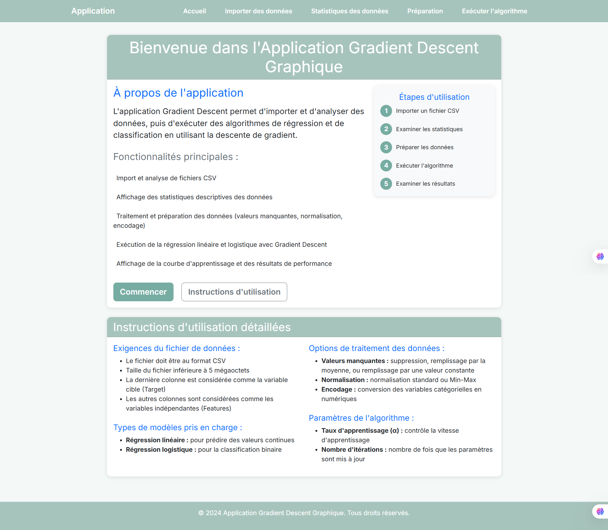
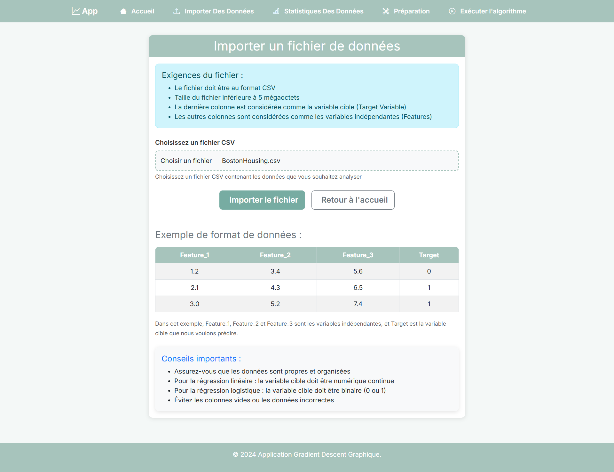
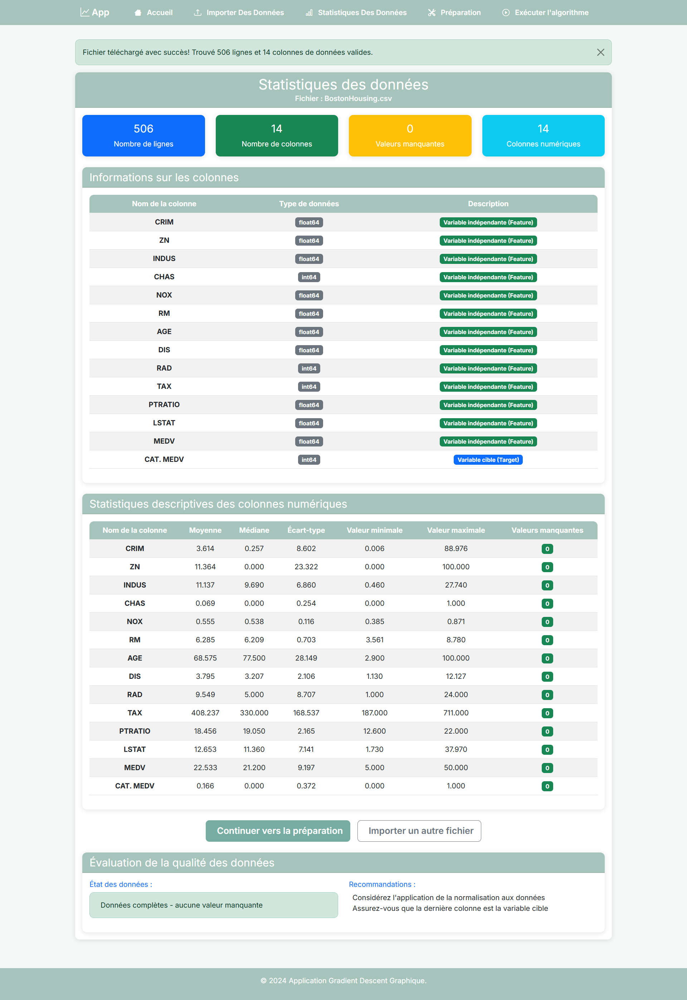
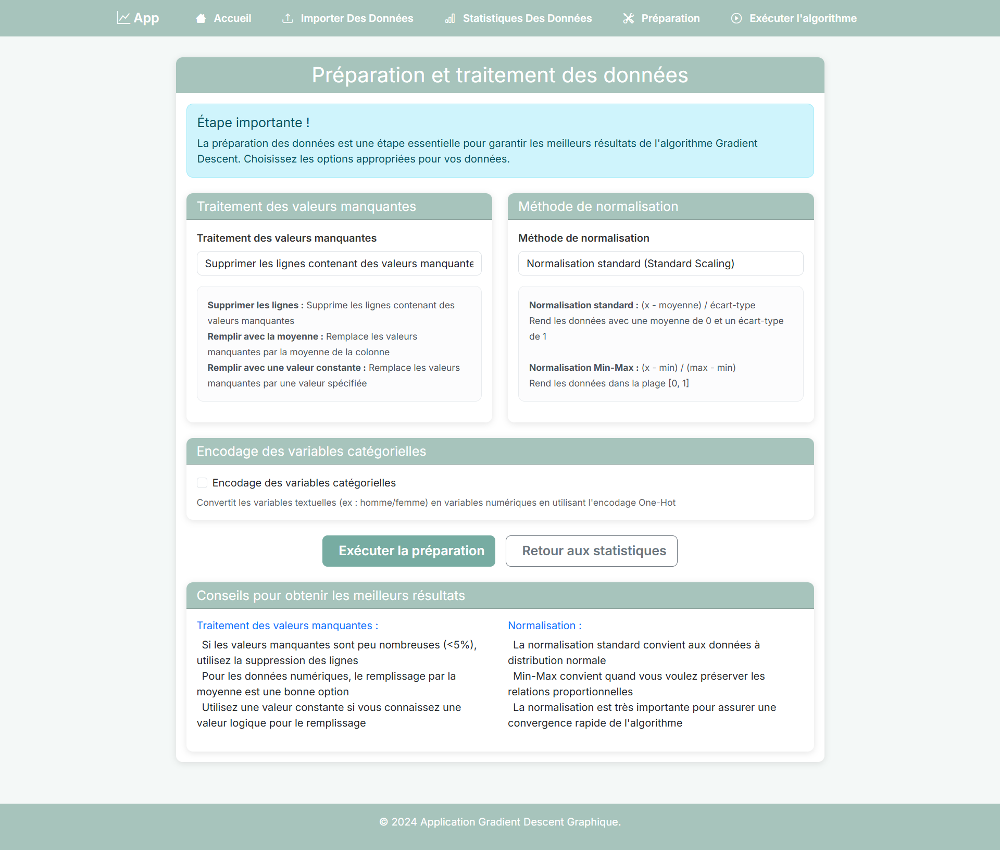
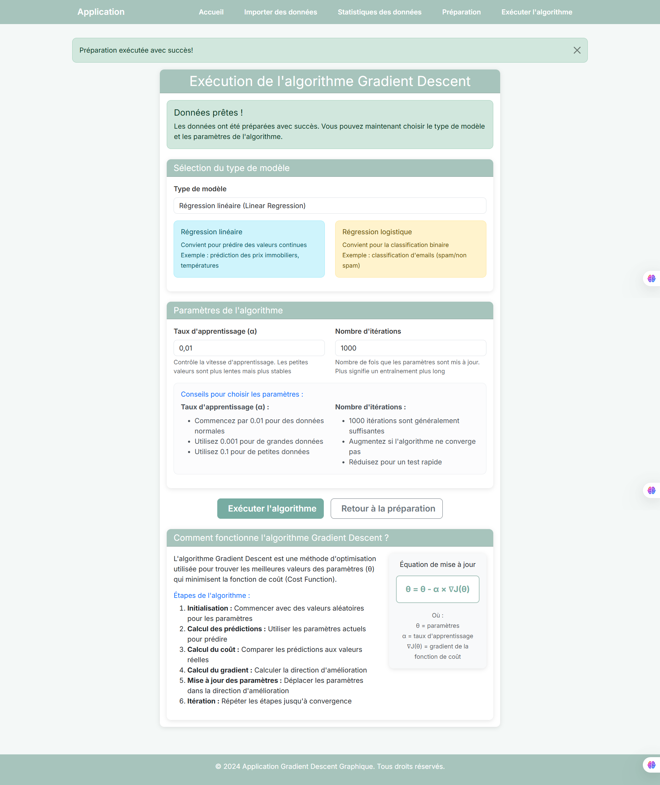
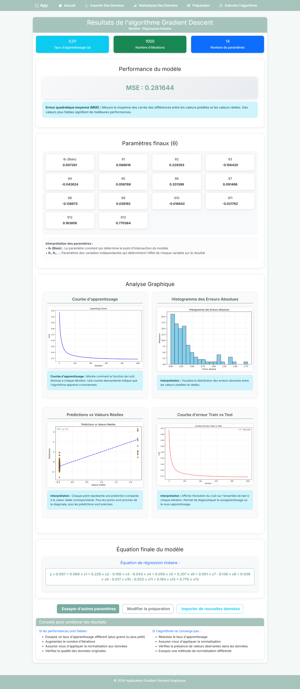

# Application Screenshots

A quick visual tour of the key pages in the “Gradient Descent Visualizer” Django app.

---

## 1. Upload CSV

**Description:**  
Select and upload your CSV file (≤ 5 MB). The app validates file size and extension, then saves your data to begin the workflow.

---

## 2. Descriptive Statistics

**Description:**  
Automatically computed summary stats for each numeric column: mean, median, standard deviation, min/max, and missing‐value count.

---

## 3. Data Preprocessing

**Description:**  
Choose how to handle missing values (drop/fill), apply Standard or Min‑Max scaling, and enable One‑Hot encoding for categorical features.

---

## 4. Algorithm Configuration

**Description:**  
Configure your Gradient Descent run: select Linear or Logistic Regression, set the learning rate (α) and number of iterations, then launch the model.

---

## 5. Live Results

**Description:**  
View final θ parameters, MSE or Accuracy, and the learning‑curve plot showing cost vs. iterations. Gain immediate insight into model performance.

---

## 6. Improvement Tips

**Description:**  
Practical suggestions for tuning your model—adjust learning rate, increase iterations, normalize data, or try alternative scaling methods.

---
